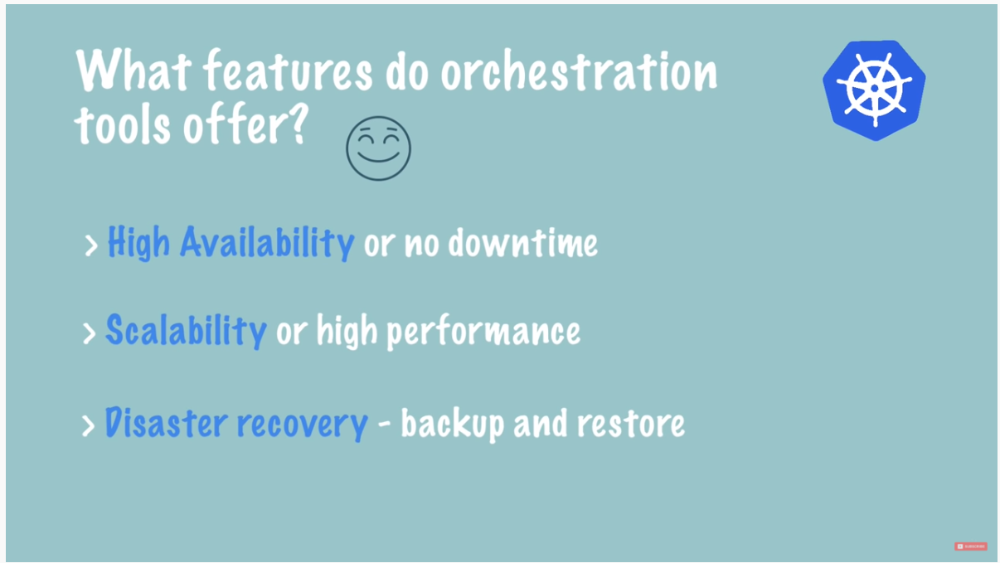
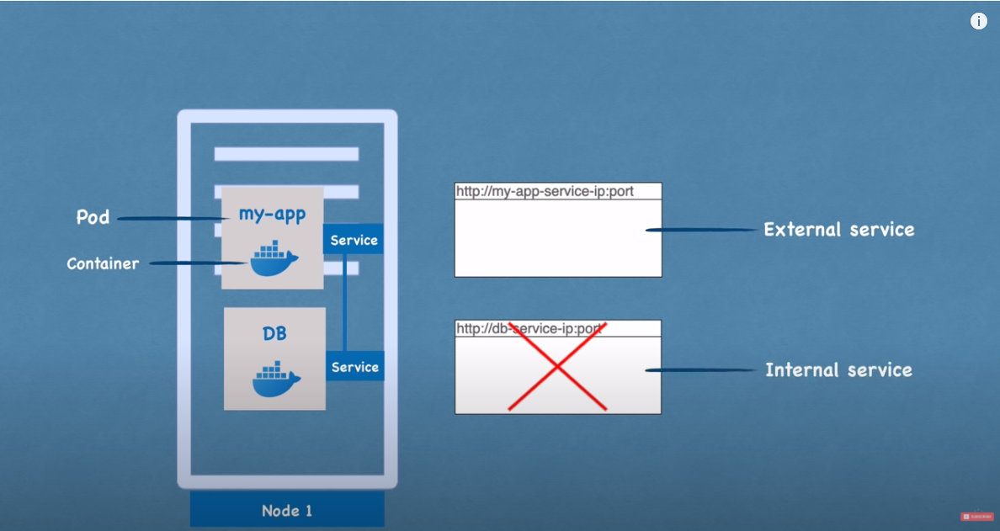
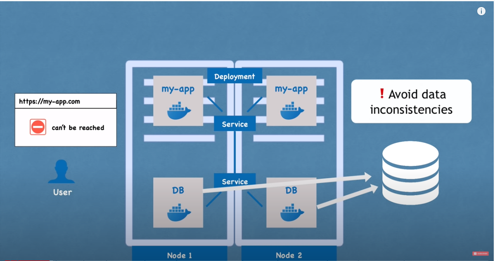
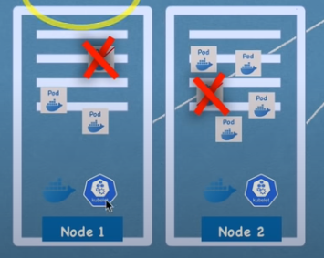

# Link
reference from [kubernetes tutorial](https://www.youtube.com/watch?v=X48VuDVv0do)

# What is K8s
```
> open source container orchestratino tool
> helps you manage containerized apps in different deployment environment
```
  

  


# Main k8s Components


## components

  
   
### 1.pod
  
### 2.service
  
   
### 3. ingress
- forward to service(url to ip address)
  
### 4. configmap
  
  
### 5. secret
  
## data-storage
### 1. volumes
- store data without removing (use external hardware)   
  

## deployment & stateful set
### deployment
- replicate application
   
  

### stateful set

- db can't be replicated by deployment because of its data(state)
   
   
  
- DBs are often hosted outside of K8s cluster ( because it's difficult to manage stateful set)
### summary 
  

## config 
# K8s Architecture
## worker machine 
  
### container runtime & kublet
  
  
  
### kubeproxy
  
   
  

## master processes
### what is master process?
  
  
### 1. API server
  
  

### 2. scheduler
  
  

### 3. controll manager
  
  
  

### 4. etcd
  
  
  
  

### summary
- api server
- master nodes
  - distributed server's api server is load balanced, etcd distirbuted storage across all master nodes

### example of adding new

  
  


# Minikube and kubctl - local setup

# Main Kubctl commands

