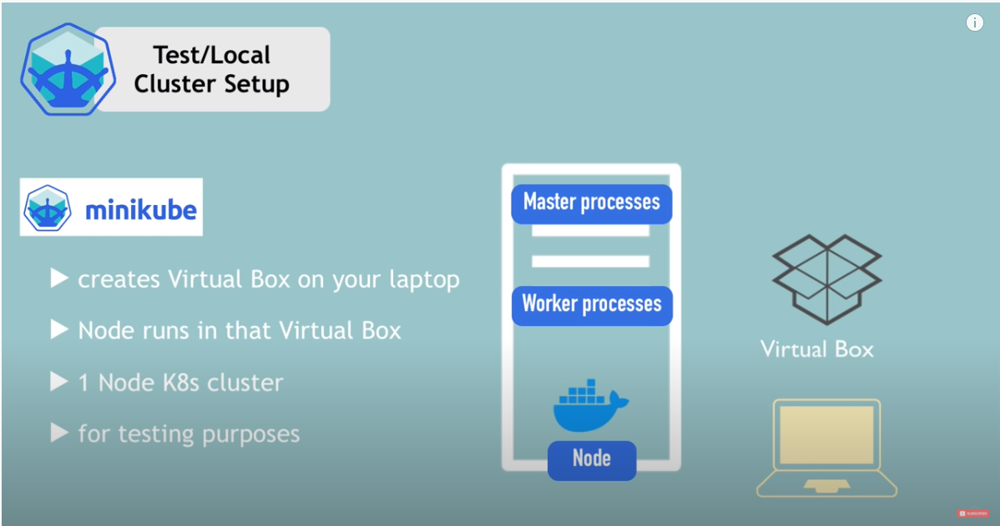

# Production Cluster Setup
## overview
  

- multiple master & worker nodes
## what is minikube
- test on local machine with k8s
  
  


## what is kubectl

- enable pods to run on node
  - create pods
  - create services
  - destroy pods

  
  

## installation
- https://minikube.sigs.k8s.io/docs/start/
- minikube has kubctl as dependency
- [hyper v for windows10](https://medium.com/@JockDaRock/minikube-on-windows-10-with-hyper-v-6ef0f4dc158c) - de

- check kubectl
```cmd
kubectl
```
```cmd
minikube
```
## start minikube with docker
```
minikube start --driver=docker
minikube config set driver docker
```
```cmd

kubectl get nodes
```

```cmd
minikube status 
```


```cmd
kubectl version

Client Version: version.Info{Major:"1", Minor:"19", GitVersion:"v1.19.7", GitCommit:"1dd5338295409edcfff11505e7bb246f0d325d15", GitTreeState:"clean", BuildDate:"2021-01-13T13:23:52Z", GoVersion:"go1.15.5", Compiler:"gc", Platform:"windows/amd64"}
Server Version: version.Info{Major:"1", Minor:"20", GitVersion:"v1.20.2", GitCommit:"faecb196815e248d3ecfb03c680a4507229c2a56", GitTreeState:"clean", BuildDate:"2021-01-13T13:20:00Z", GoVersion:"go1.15.5", Compiler:"gc", Platform:"linux/amd64"}
```