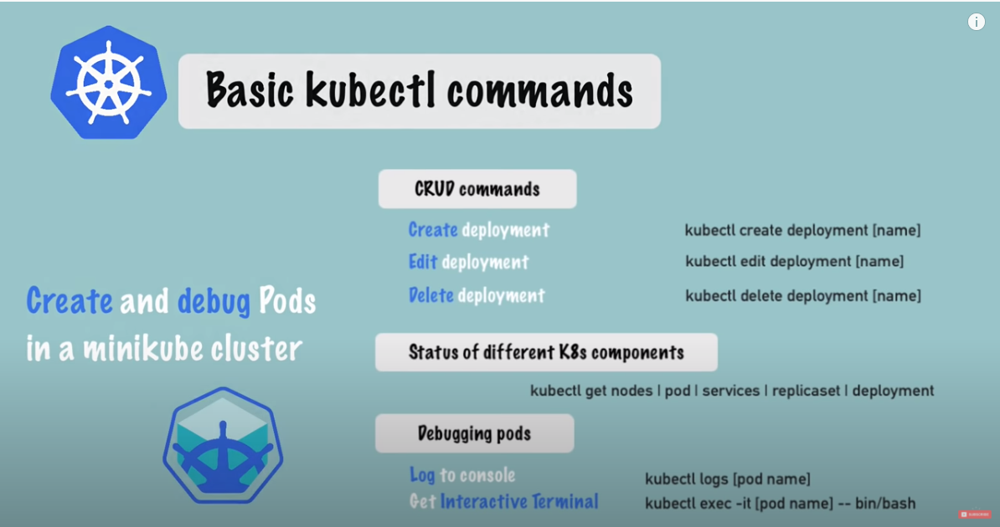
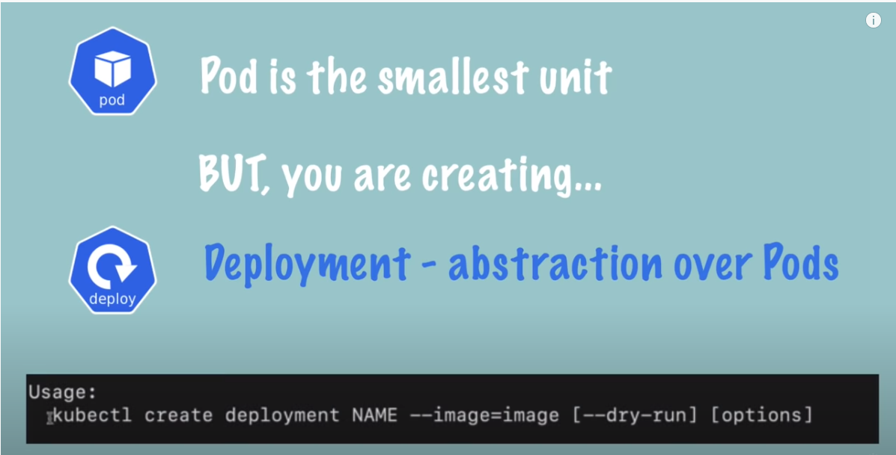
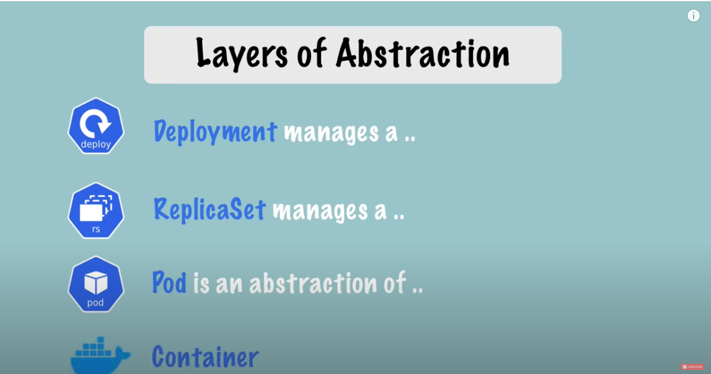

# 동영상
[유튜브링크](https://www.youtube.com/watch?v=X48VuDVv0do&t=2692s)
# main kubectl commands
# overview
  
## layers of abstarction
  
  

## get infos
```
kubectl get nodes
```
```
kubectl get pods
```
```
kubectl get services
```


## create

```cmd
$> kubectl create deployment nginx-depl --image=nginx
```
```cmd
$> kubectl get deployment
NAME         READY   UP-TO-DATE   AVAILABLE   AGE
nginx-depl   0/1     1            0           9s
```
```cmd
$> kubectl get pod
NAME                          READY   STATUS    RESTARTS   AGE
nginx-depl-5c8bf76b5b-d8tb6   1/1     Running   0          59s
```
- replicaset is managing the replicas of pod
```cmd
> kubectl get replicaset
NAME                    DESIRED   CURRENT   READY   AGE
nginx-depl-5c8bf76b5b   1         1         1       108s
```

## edit
```cmd
kubectl edit deployment 
```
- change nginx --> nginx:1.16
```
...
spec:
      containers:
      - image: nginx
```
- new pod 
```
kubectl get pods
NAME                          READY   STATUS    RESTARTS   AGE
nginx-depl-7fc44fc5d4-9blmz   1/1     Running   0          63s
```
- new replica set
```
kubectl get replicasets
NAME                    DESIRED   CURRENT   READY   AGE
nginx-depl-5c8bf76b5b   0         0         0       7m11s
nginx-depl-7fc44fc5d4   1         1         1       113s
```

## debug
> kubectl logs [podname]
> kubectl exec -it [podname] -- /bin/bash
> kubectl describe pod [podname]

```
kubectl logs nginx-depl-7fc44fc5d4-9blmz
```

```
kubectl create deployment mongo-depl --image=mongo
```
- get pod list : kubectl get pod 
```
kubectl get pod
NAME                          READY   STATUS    RESTARTS   AGE
mongo-depl-5fd6b7d4b4-2bd92   1/1     Running   0          79s
nginx-depl-7fc44fc5d4-9blmz   1/1     Running   0          5m29s
```
- get pod description : kubectl pod describe [pod name]
```
kubectl describe pod mongo-depl-5fd6b7d4b4-2bd92
```
- get pod log : kubectl logs [pod name]
```
kubectl logs mongo-depl-5fd6b7d4b4-2bd92
```
- kubectl exec -it [podname] -- /bin/bash
```
kubectl exec -it mongo-depl-5fd6b7d4b4-2bd92 -- /bin/bash
```

## delete
- kubectl delete deployment [depoyment name] 
```
#> kubectl delete deployment mongo-depl

deployment.apps "mongo-depl" deleted
```

## apply
> kubectl apply -f [config file name]
> kubectl delete -f [config file name]

- nginx-deployment.yaml
```yaml
apiVersion: apps/v1
kind: Deployment
metadata:
  name: nginx-deployment
spec:
  selector:
    matchLabels:
      app: nginx
  replicas: 2 # tells deployment to run 2 pods matching the template
  template:
    metadata:
      labels:
        app: nginx
    spec:
      containers:
      - name: nginx
        image: nginx:1.16
        ports:
        - containerPort: 80
```
kubectl apply -f [configurationfile.yaml]
```
kubectl apply -f configsnginx-deployment.yaml

deployment.apps/nginx-deployment created
```

- apply after config file changed
```
kubectl apply -f configsnginx-deployment.yaml

deployment.apps/nginx-deployment configured
```
