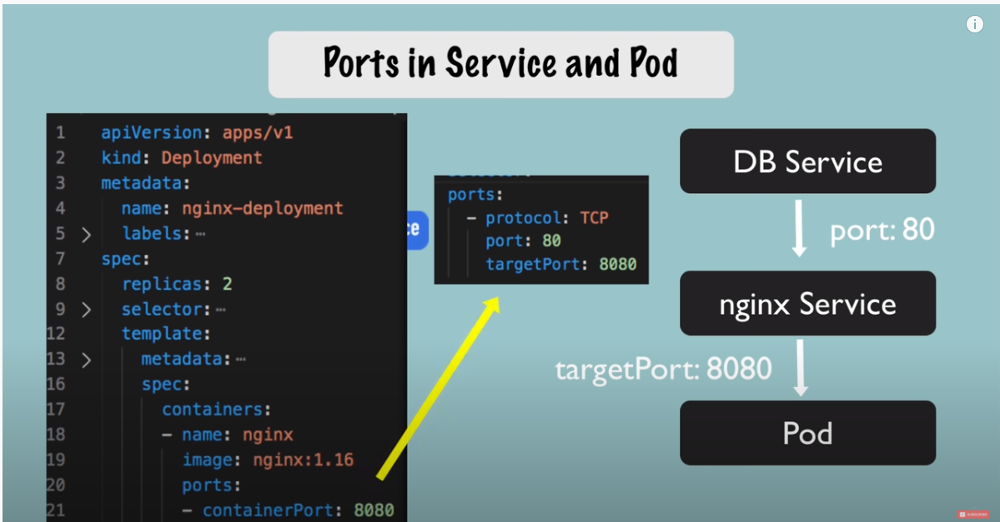

# 링크
[동영상](https://www.youtube.com/watch?v=X48VuDVv0do&t=3723s)
# config file 
## 1. meta data
## 2. specification

## 3. status <- auto generated by k8
- generated status part is not the same with original yaml file
  

  


# labels & selectors

- connect services to deployment
  
  

# commands
## apply with files
```
kubectl apply -f configsnginx-deployment.yaml
```
```
kubectl apply -f configsnginx-services.yaml
```
```
kubectl get service
NAME            TYPE        CLUSTER-IP      EXTERNAL-IP   PORT(S)   AGE
kubernetes      ClusterIP   10.96.0.1       <none>        443/TCP   73m
nginx-service   ClusterIP   10.110.205.35   <none>        80/TCP    22s
```

```
kubectl describe service nginx-service

Name:              nginx-service
Namespace:         default
Labels:            <none>
Annotations:       <none>
Selector:          app=nginx
Type:              ClusterIP
IP:                10.110.205.35
Port:              <unset>  80/TCP
TargetPort:        8080/TCP
Endpoints:         172.17.0.3:8080,172.17.0.4:8080
Session Affinity:  None
Events:            <none>
```

```
get pod -o wide

NAME                               READY   STATUS    RESTARTS   AGE   IP           NODE       NOMINATED NODE   READINESS GATES
nginx-deployment-f4b7bbcbc-7k7m7   1/1     Running   0          10m   172.17.0.3   minikube   <none>           <none>
nginx-deployment-f4b7bbcbc-g6hqc   1/1     Running   0          10m   172.17.0.4   minikube   <none>           <none>
```

```
kubectl get deployment nginx-deployment -o yaml
```
- get result yaml
```
kubectl get deployment nginx-deployment -o yaml > configsnginx-deployment-result.yaml
```

## delete
```
kubectl delete -f configsnginx-deployment.yaml

deployment.apps "nginx-deployment" deleted
```
```
kubectl delete -f configsnginx-service.yaml

service "nginx-service" deleted
```