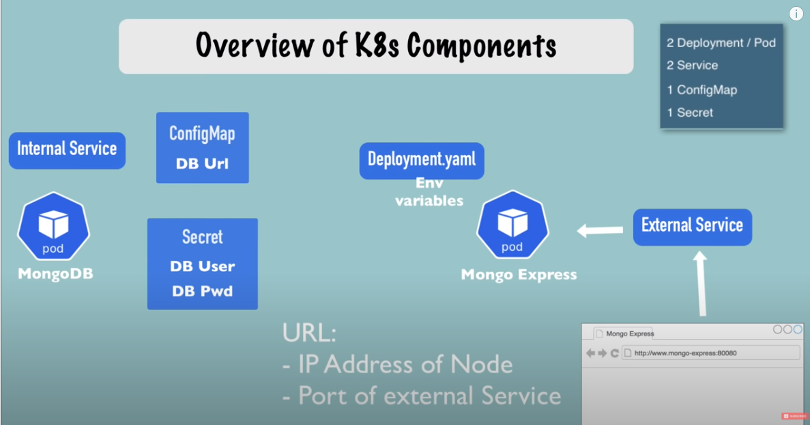
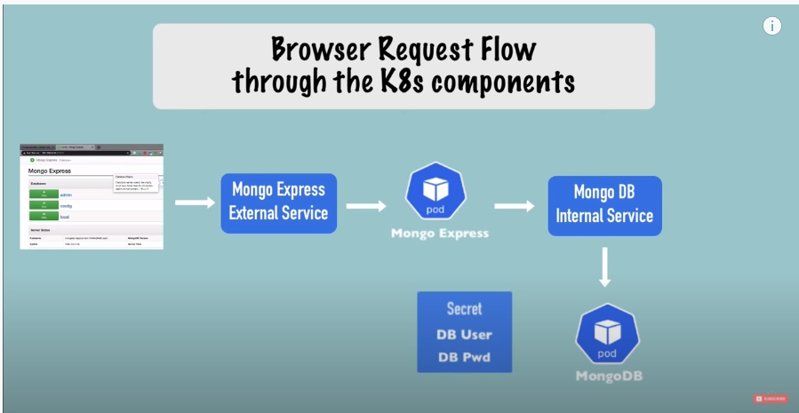
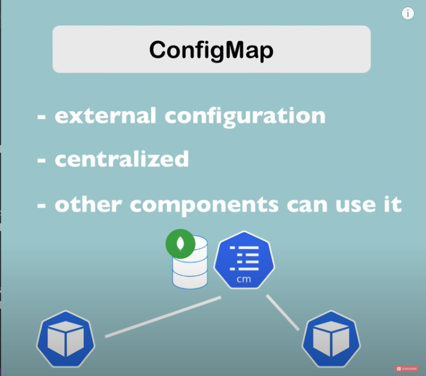
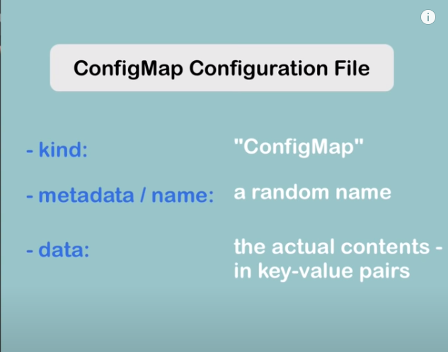
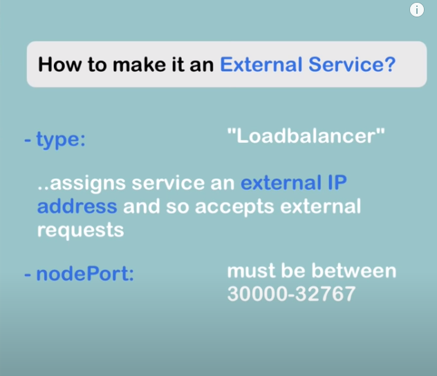
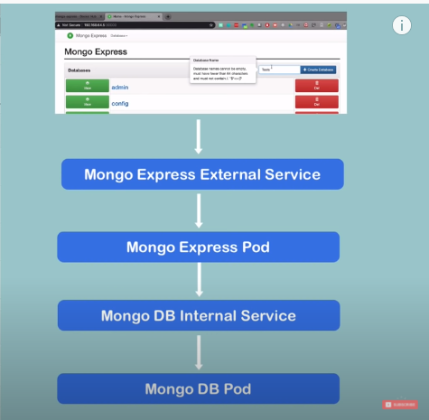

# 링크
[동영상](https://www.youtube.com/watch?v=X48VuDVv0do&t=4576s)
# 0. mongo express external service
  

  
# 1. mongo deployment& service
## 1. mongodb deployment

[info of image mongo](https://hub.docker.com/_/mongo)
```yaml
apiVersion: apps/v1
kind: Deployment
metadata:
  name: mongodb-deployment
spec:
  selector:
    matchLabels:
      app: mongodb
  replicas: 2 # tells deployment to run 2 pods matching the template
  template:
    metadata:
      labels:
        app: mongodb
    spec:
      containers:
      - name: mongodb
        image: mongo
        ports: 
          - containerPort: 27017
        env:
        - name: MONGO_INITDB_ROOT_USERNAME
          valueFrom: # secret(in kubernetes) will fill this
            secretKeyRef:
                name: mongodb-secret
                key: mongo-root-username
        - name: MONGO_INITDB_ROOT_PASSWORD
          valueFrom: # secret(in kubernetes) will fill this
            secretKeyRef:
                name: mongodb-secret
                key: mongo-root-password
        value: # secret(in kubernetes) will fill this
```

## 2. mongodb-secret.yaml
- change it to base64
```
echo -n 'username' | base64
dXNlcm5hbWU=
echo -n 'password' | base64
cGFzc3dvcmQ=
```
- mongo root
```yaml
apiVersion: v1
kind: Secret
metadata:
  name: mongodb-secret
type: Opaque
data:
  mongo-root-username: dXNlcm5hbWU=
  mongo-root-password: cGFzc3dvcmQ=

```


  

- secret must be created before deployment

```
kubectl apply -f configs/mongodb-secret.yaml

secret/mongodb-secret
```

```
kubectl get secret
```
```
kubectl apply -f configs/mongodb.yaml
```

## add service to mongo.yaml
```yaml
---

apiVersion: v1
kind: Service
metadata:
  name: mongodb-service
spec:
  selector:
    app: mongodb
  ports:
    - protocol: TCP
      port: 27017
      targetPort: 27017
```

# 3. mongo configmap & express

  
## mongo config map
[mongo express docker image](https://hub.docker.com/_/mongo-express)

  
- mongo-configmap.yaml
```yaml
apiVersion: v1
kind: ConfigMap
metadata:
  name: mongodb-configmap
data:
  database_url: mongodb-service
```

- mongo-express.yaml


```yaml
apiVersion: apps/v1
kind: Deployment
metadata:
  name: mongodb-express
spec:
  selector:
    matchLabels:
      app: mongodb-express
  replicas: 2 # tells deployment to run 2 pods matching the template
  template:
    metadata:
      labels:
        app: mongodb-express
    spec:
      containers:
      - name: mongodb-express
        image: mongo-express
        ports: 
          - containerPort: 8081
        env:
        - name: ME_CONFIG_MONGODB_ADMINUSERNAME
          valueFrom: # secret(in kubernetes) will fill this
            secretKeyRef:
                name: mongodb-secret
                key: mongo-root-username
        - name: ME_CONFIG_MONGODB_ADMINPASSWORD
          valueFrom: # secret(in kubernetes) will fill this
            secretKeyRef:
                name: mongodb-secret
                key: mongo-root-password
        - name: ME_CONFIG_MONGODB_SERVER
          valueFrom: # secret(in kubernetes) will fill this
            configMapKeyRef:
                name: mongodb-configmap
                key: database_url
```
```
kubectl apply -f configs/mongo-configmap.yaml
kubectl apply -f configs/mongo-express.yaml
```

# 4. mongo express service & exernal
## external service

  


- mongo-express.yaml에 추가
```yaml

---
apiVersion: v1
kind: Service
metadata:
  name: mongo-express-service
spec:
  selector:
    app: mongodb-express
  type: LoadBalancer 
  ports:
    - protocol: TCP
      port: 8081
      targetPort: 8081
      nodePort: 30000 # port for external ip address access
```
## 서버 올리기
- in windows
```
minikube service mongo-express-service
```
- data base 변경시 일어나는 과정
  