# 링크
[동영상](https://www.youtube.com/watch?v=X48VuDVv0do&t=6376s)

# what is name spaces
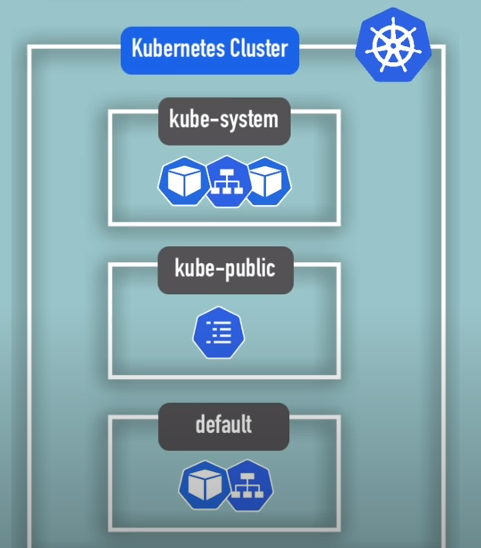   
```
kubectl get namespace
```
- 결과
```
NAME              STATUS   AGE
default           Active   9m1s
kube-node-lease   Active   9m2s
kube-public       Active   9m2s
kube-system       Active   9m2s
```
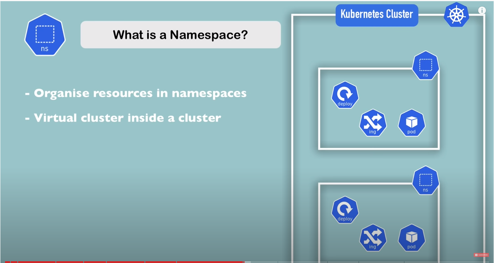   

## kubernetes-dashboard
- minikube에만 있는 namespace
## kube-system
   

## kube-node-lease
   

## default

# create a name space
## command
```
kubectl create namespace my-namespace
```
```
kubectl get namespace
```
## configfile
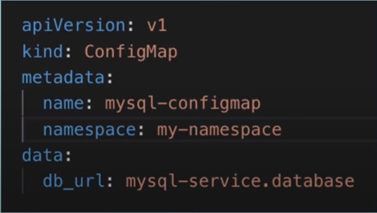   

# Why to use namespaces(왜 namespace를 사용해야 하는가?)
```
1. structure your components
2. avoid conflicts between teams
3. share services between different environments
4. access and resource limits on namespaces level
```
## 1. structure your components
- 데이터가 엉켜 있는 상황
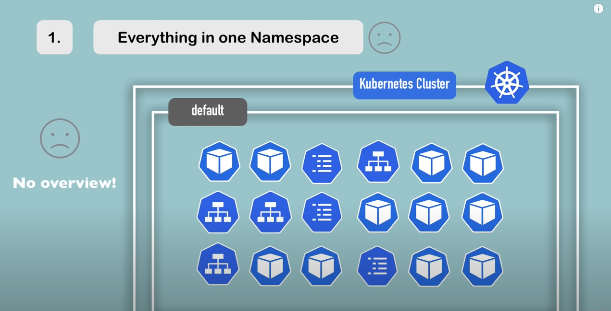   
- 해결
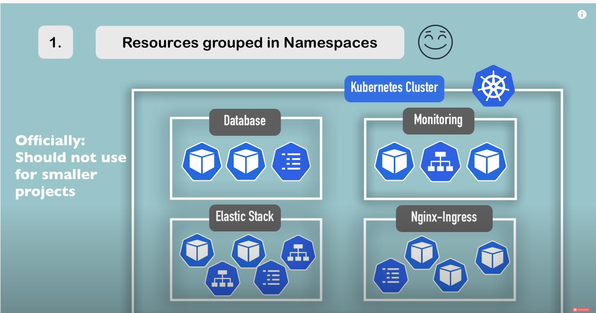   
## 2. avoid conflicts between teams
- 팀끼리 같은 어플리케이션 사용 문제: 같은이름으로 앱을 올리면 override됨
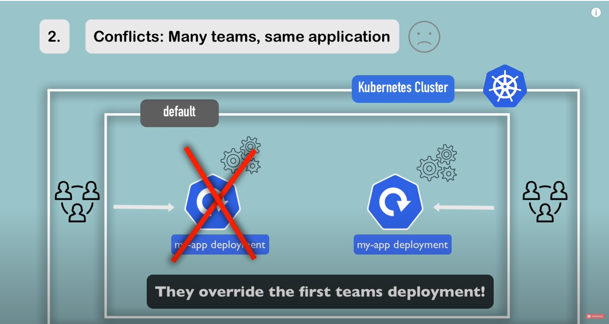   
- 해결: 다른 namespace
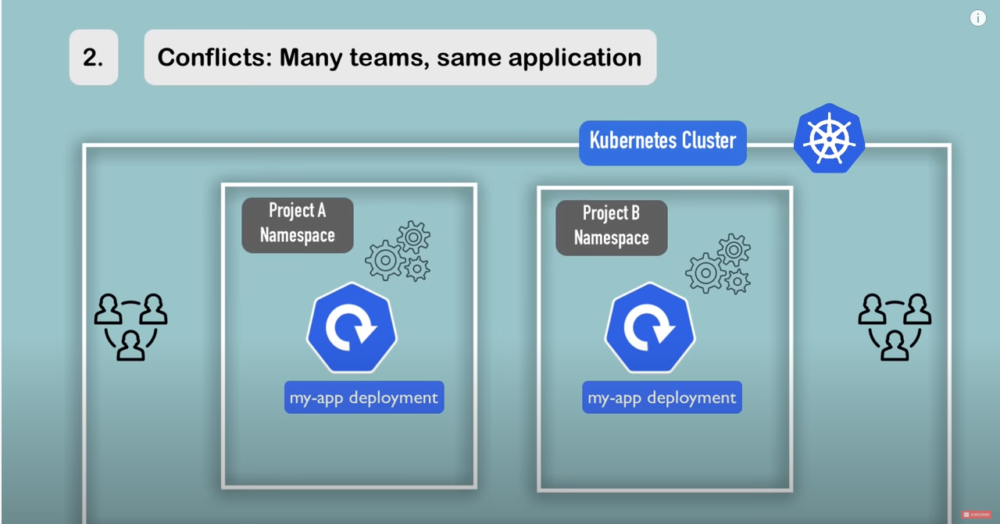   

## 3. share services between different environments
- 다른 환경(staging, develpoment)에서 같은 nginx-ingress, elastic stack 사용
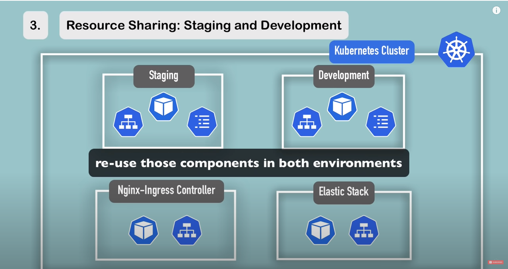   
- 다른 deploy(staging, develpoment)에서 같은 nginx-ingress, elastic stack 사용
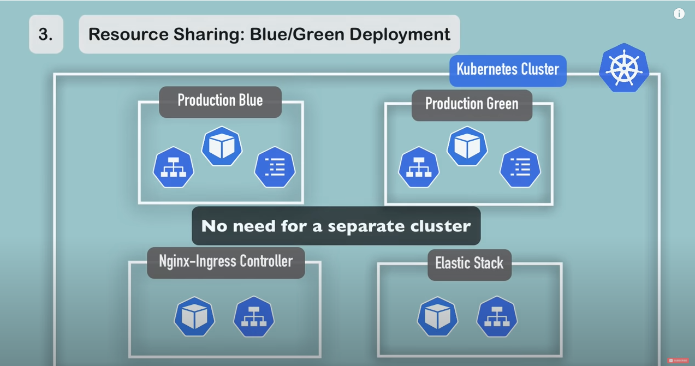   
## 4. access and resource limits on namespaces level
- 각각의 팀은 각각의 namespace만 쓰고, name space의 리소스 또한 limit을 정한다.
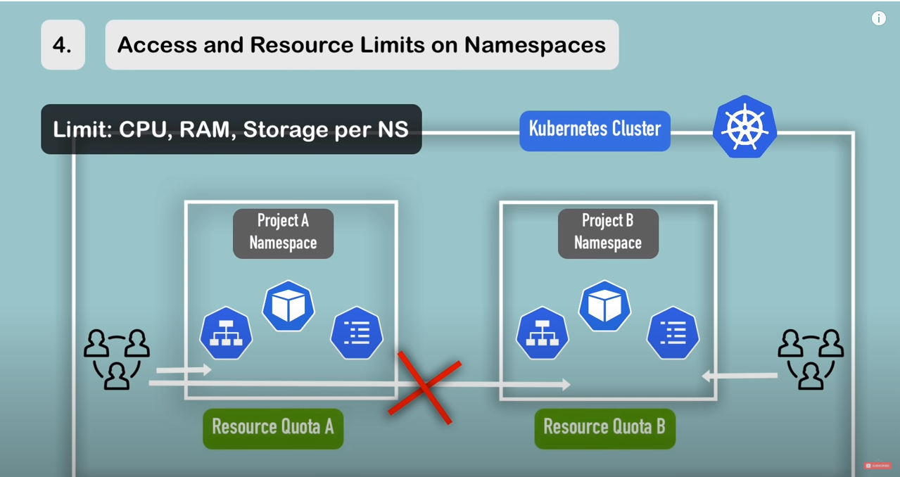   

# Characteristics of namespaces(name space의 특징)
## 1.많은 리소스를 다른 name space에서 사용할 수 없다 
- configmap, secret은 namespace마다 새로 만들어야함  
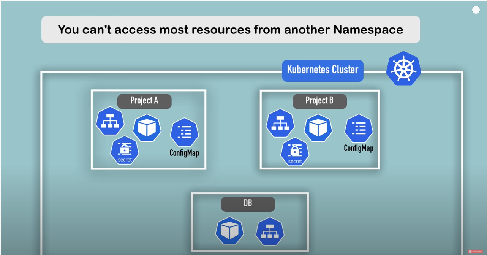   
- 다른 namespace 연결시 컨테이너명.namespace의 형태로 사용  
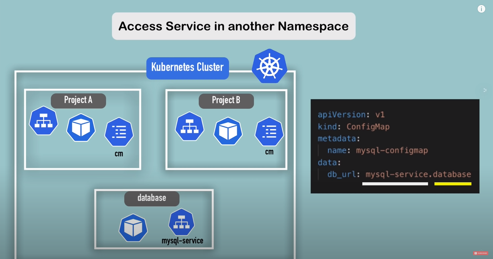    
# namespace에서 만들어지지 않는 컴포넌트가 있다. (volume, node)
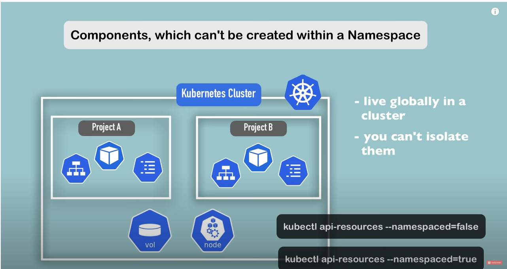   
```
# namespace에서 생성 안되는 것들 확인
kubectl api-resources --namespaced=false 
# namespace에서 생성 되는 것들 확인
kubectl api-resources --namespaced=true 
```

# Create component in a name space


## command (name space: default)
- 명령어
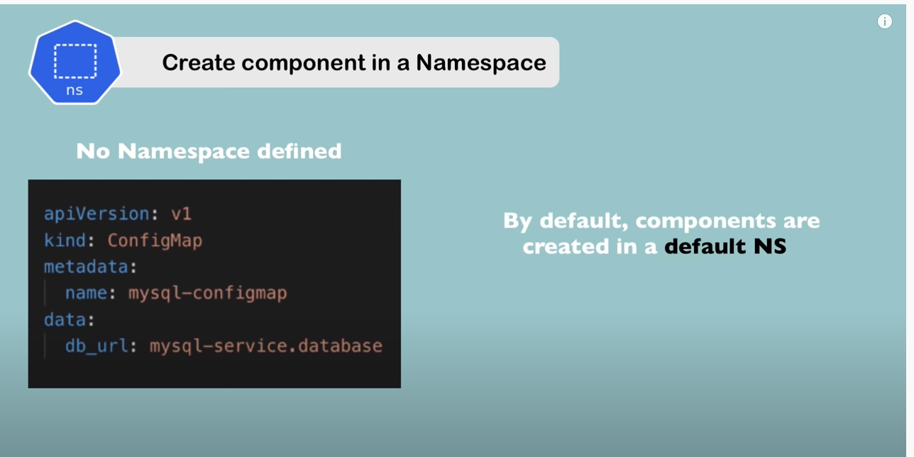   
```
kubectl apply -f configs/name_space/mysql-configmap.yaml
```
- 결과: 기본 default로 생성
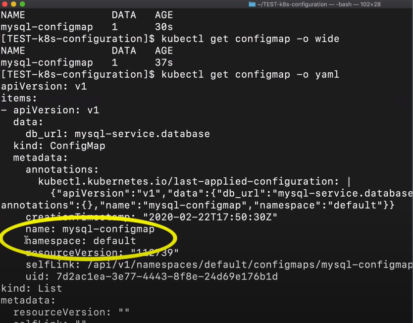   

## command (with namespace)
```
kubectl apply -f configs/name_space/mysql-configmap.yaml --namespace=my-namespace
```
## yaml에 name space 추가
- mysql-configmap2.yaml
```yaml
apiVersion: v1
kind: ConfigMap
metadata:
  name: mysql-configmap
  namespace: my-namespace
data:
  database_url: mysql-service.database
```

```
kubectl apply -f configs/name_space/mysql-configmap2.yaml 
```